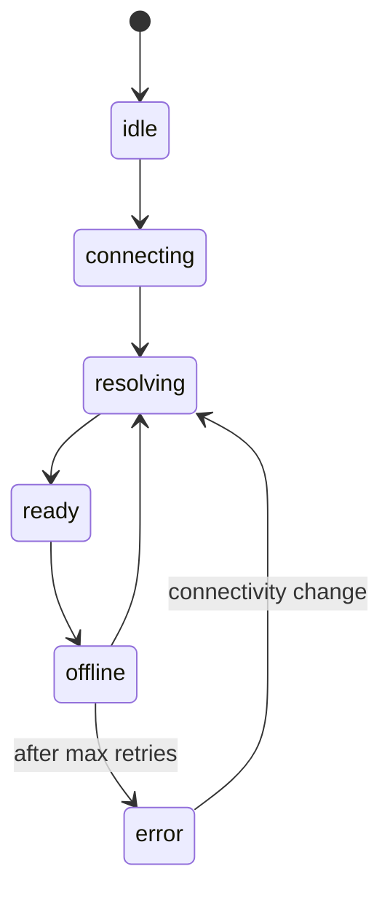

<svelte:head>

  <title>Browser API - convex-embedded</title>
</svelte:head>

# Browser API

The browser entry point (`@robelest/convex-embedded/browser`) provides a single
factory function that creates a standard `ConvexClient` backed by a local
embedded Convex runtime. The returned client is fully compatible with
`ConvexProvider`, `convex-svelte`, and any other Convex framework integration.

```ts
import {
  createConvexClient,
  getRemoteState,
  subscribeRemoteState,
  getAuthState,
  subscribeAuthState,
  setAuthIdentity,
  getAuthIdentity,
} from "@robelest/convex-embedded/browser";
```

---

## `createConvexClient(options)`

Creates a `ConvexClient` backed by the local embedded Convex runtime.

```ts
function createConvexClient(options: ClientOptions): ConvexClient;
```

The factory creates an `EmbeddedRuntime` on the main thread, connects it to a
`ConvexClient` via a loopback WebSocket transport, and initializes wa-sqlite
persistence in a Dedicated Worker. The returned client behaves identically to a
normal `ConvexClient` connected to a remote deployment.

**Without `remote`**: Purely local. Queries and mutations run against an
in-browser database persisted to IndexedDB via wa-sqlite. No network traffic.

**With `remote`**: Local-first with transparent remote. Queries read from the
local embedded database (instant, offline-capable). Mutations write locally
first, then replay to the remote deployment via a durable queue. Reactive
subscriptions on the remote keep local state fresh with changes from other
clients. On reconnect, a Yjs CRDT resolve pass merges any state that diverged
while offline.

Call `client.close()` to tear down the runtime, worker, resolve engine, and all
subscriptions.

### Local-only example

```ts
const client = createConvexClient({
  modules: import.meta.glob("./convex/*.ts"),
});
```

### With remote

```ts
const client = createConvexClient({
  modules: import.meta.glob("./convex/*.ts"),
  remote: { url: "https://happy-otter-123.convex.cloud" },
});
```

### SvelteKit example

```ts
import { createConvexClient } from "@robelest/convex-embedded/browser";
import { setConvexClientContext } from "convex-svelte";
import { onDestroy } from "svelte";

const client = createConvexClient({
  modules: import.meta.glob("./convex/*.ts"),
  remote: { url: import.meta.env.CONVEX_URL },
});

setConvexClientContext(client);
onDestroy(() => client.close());
```

### React example

```tsx
import { createConvexClient } from "@robelest/convex-embedded/browser";
import { ConvexProvider } from "convex/react";

const client = createConvexClient({
  modules: import.meta.glob("./convex/*.ts"),
  remote: { url: import.meta.env.CONVEX_URL },
});

function App() {
  return (
    <ConvexProvider client={client}>
      <MyApp />
    </ConvexProvider>
  );
}
```

---

## `ClientOptions`

Configuration for `createConvexClient`.

```ts
interface ClientOptions {
  modules: Record<string, () => Promise<unknown>>;
  schema?: unknown;
  clientOptions?: Omit<
    Partial<BaseConvexClientOptions>,
    "webSocketConstructor"
  >;
  workerUrl?: URL | string;
  name?: string;
  remote?: RemoteOptions;
  auth?: AuthOptions;
}
```

| Field           | Type                                         | Default             | Description                                      |
| --------------- | -------------------------------------------- | ------------------- | ------------------------------------------------ |
| `modules`       | `Record<string, () => Promise<unknown>>`     | **required**        | From `import.meta.glob()`. No `{ eager: true }`. |
| `schema`        | `unknown`                                    | `undefined`         | Default export from `convex/schema.ts`.          |
| `clientOptions` | `Omit<Partial<...>, "webSocketConstructor">` | `undefined`         | Forwarded to `ConvexClient`.                     |
| `workerUrl`     | `URL \| string`                              | auto-resolved       | wa-sqlite worker URL. Rarely needed.             |
| `name`          | `string`                                     | `"convex-embedded"` | IndexedDB database name. Shared across tabs.     |
| `remote`        | `RemoteOptions`                              | `undefined`         | Enable remote. Omit for local-only.              |
| `auth`          | `AuthOptions`                                | `undefined`         | Auth configuration.                              |

---

## `RemoteOptions`

Configuration for remote (resolve). Provided as the `remote` option to
`createConvexClient`.

```ts
interface RemoteOptions {
  url: string;
  maxRetries?: number;
  retryDelayMs?: number;
}
```

| Field          | Type     | Default      | Description                                 |
| -------------- | -------- | ------------ | ------------------------------------------- |
| `url`          | `string` | **required** | Remote Convex deployment URL.               |
| `maxRetries`   | `number` | `3`          | Max retries for CRDT resolve on reconnect.  |
| `retryDelayMs` | `number` | `1000`       | Base retry delay (ms). Exponential backoff. |

---

## `AuthOptions`

Configuration for embedded auth. Provided as the `auth` option to
`createConvexClient`.

```ts
interface AuthOptions {
  fetchToken?: AuthTokenFetcher;
  getUserIdentity?: () => Promise<UserIdentity | null>;
  getIdentityKey?: (identity: UserIdentity | null) => string | null;
  verifyToken?: (token: string) => Promise<UserIdentity | null>;
}
```

| Field             | Type                                                 | Default                      | Description                          |
| ----------------- | ---------------------------------------------------- | ---------------------------- | ------------------------------------ |
| `fetchToken`      | `AuthTokenFetcher`                                   | `undefined`                  | Passed to `client.setAuth(...)`.     |
| `getUserIdentity` | `() => Promise<UserIdentity \| null>`                | `undefined`                  | Returns the local embedded identity. |
| `getIdentityKey`  | `(identity: UserIdentity \| null) => string \| null` | `tokenIdentifier ?? subject` | Groups identities for local state.   |
| `verifyToken`     | `(token: string) => Promise<UserIdentity \| null>`   | `undefined`                  | Verifies embedded protocol tokens.   |

The `UserIdentity` type:

```ts
interface UserIdentity {
  subject: string;
  issuer: string;
  tokenIdentifier: string;
  name?: string;
  email?: string;
  pictureUrl?: string;
  nickname?: string;
  givenName?: string;
  familyName?: string;
  emailVerified?: boolean;
  phoneNumber?: string;
  phoneNumberVerified?: boolean;
  updatedAt?: string;
  [key: string]: unknown;
}
```

---

## `RemoteState`

Discriminated union describing the current remote state of the client.

```ts
type RemoteState =
  | { status: "idle" }
  | { status: "connecting" }
  | { status: "resolving"; progress?: { completed: number; total: number } }
  | { status: "ready" }
  | { status: "offline" }
  | { status: "error"; error?: Error };
```

| Status       | Description                                                                                                                                       |
| ------------ | ------------------------------------------------------------------------------------------------------------------------------------------------- |
| `idle`       | Sync was not configured (no `remote` option), or the engine has not started yet.                                                                  |
| `connecting` | The remote `ConvexClient` is establishing its WebSocket connection.                                                                               |
| `resolving`  | The CRDT resolve pass is in progress. `progress` reports tables resolved so far.                                                                  |
| `ready`      | All tables are resolved and reactive subscriptions are active. Normal steady-state while online.                                                  |
| `offline`    | Network is unavailable. Mutations continue to work locally with queued replay. The engine re-resolves automatically when connectivity returns.    |
| `error`      | The resolve pass failed after exhausting retries. `error` contains the underlying `Error`. Recovery is attempted on the next connectivity change. |

State machine transitions:



---

## `AuthState`

Discriminated union describing the current embedded auth state.

```ts
type AuthState =
  | { status: "idle" }
  | { status: "refreshing" }
  | { status: "unauthenticated" }
  | { status: "authenticated"; identity?: UserIdentity; identityKey?: string }
  | { status: "offlineStale"; identity?: UserIdentity; identityKey?: string }
  | { status: "reauthRequired"; identity?: UserIdentity; identityKey?: string }
  | {
      status: "identityMismatch";
      identity?: UserIdentity;
      identityKey?: string;
    }
  | { status: "error"; error: Error };
```

| Status             | Description                                                                                   |
| ------------------ | --------------------------------------------------------------------------------------------- |
| `idle`             | Auth has not been initialized yet.                                                            |
| `refreshing`       | A token refresh or identity lookup is in progress.                                            |
| `unauthenticated`  | No identity is set. The user is logged out.                                                   |
| `authenticated`    | An identity is active and verified.                                                           |
| `offlineStale`     | An identity was previously authenticated but the token could not be refreshed (e.g. offline). |
| `reauthRequired`   | The stored identity requires re-authentication (e.g. expired session).                        |
| `identityMismatch` | The active identity changed while pending remote work exists for a different identity.        |
| `error`            | Auth encountered an unrecoverable error.                                                      |

---

## `getRemoteState(client)`

Point-in-time read of the current resolve state.

```ts
function getRemoteState(client: ConvexClient): RemoteState;
```

Returns `{ status: "idle" }` if the client was created without `remote`, if
remote has not started yet, or if the client was not created by
`createConvexClient`. Uses a `WeakMap` lookup keyed on the client instance
(O(1)).

```ts
const state = getRemoteState(client);
if (state.status === "ready") {
  console.log("All tables are up to date");
}
```

---

## `subscribeRemoteState(client, callback)`

Subscribe to resolve state transitions. Returns an unsubscribe function.

```ts
function subscribeRemoteState(
  client: ConvexClient,
  callback: (state: RemoteState) => void,
): () => void;
```

The callback fires **synchronously** on each state transition. Returns a no-op
unsubscribe if the client was created without `remote` or was not created by
`createConvexClient`. The subscription is automatically cleaned up when
`client.close()` is called.

```ts
const unsub = subscribeRemoteState(client, (state) => {
  switch (state.status) {
    case "ready":
      badge.textContent = "Online";
      break;
    case "offline":
      badge.textContent = "Offline";
      break;
    case "resolving":
      badge.textContent = `Syncing ${state.progress?.completed ?? 0}/${state.progress?.total ?? "?"}...`;
      break;
    case "error":
      badge.textContent = `Error: ${state.error?.message}`;
      break;
  }
});

// Later, to stop receiving updates:
unsub();
```

---

## `getAuthState(client)` / `subscribeAuthState(client, callback)`

Read or subscribe to the embedded auth state.

```ts
function getAuthState(client: ConvexClient): AuthState;

function subscribeAuthState(
  client: ConvexClient,
  callback: (state: AuthState) => void,
): () => void;
```

`getAuthState` returns `{ status: "idle" }` if the client was not created by
`createConvexClient`. `subscribeAuthState` returns a no-op unsubscribe in the
same case.

---

## `setAuthIdentity(client, identity)`

Set the embedded identity for local auth-aware execution.

```ts
function setAuthIdentity(
  client: ConvexClient,
  identity: UserIdentity | null,
): Promise<void>;
```

Updates only the embedded runtime identity and auth state. Does **not** install
or replace the remote token fetcher. Pair it with `client.setAuth(...)` or
`createConvexClient({ auth })` when you also need remote Convex auth.

Pass `null` to clear the identity (simulate an unauthenticated state).

---

## `getAuthIdentity(client)`

Get the current embedded identity for a client.

```ts
function getAuthIdentity(client: ConvexClient): UserIdentity | null;
```

Returns `null` if the client was not created by `createConvexClient` or if no
identity is currently active.
