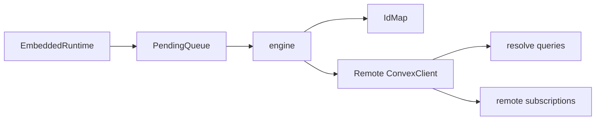

<svelte:head>

  <title>Client API - convex-embedded</title>
</svelte:head>

# Client API

The client entry point (`@robelest/convex-embedded/client`) is the advanced
bootstrap surface for convex-embedded. Most applications should still start with
[Browser API](/api/browser), but this module now includes the public
`createReplica(...)` helper used for SSR/bootstrap flows.

```ts
import {
  createReplica,
  engine,
  runtime,
  IdMap,
  PendingQueue,
  clientSchema,
} from "@robelest/convex-embedded/client";
```

## What this entry point is for

Use this module if you are:

- building an SSR/bootstrap flow with `createReplica(...)`
- building a non-browser wrapper around the embedded runtime
- testing or inspecting replay / resolve behavior directly
- integrating custom storage, connectivity, or processor identity adapters
- working with low-level Yjs helpers that sit below the public browser API

For typical app code, start with the browser or Expo entry points.

## Main exports

### `createReplica`

Builds a serializable replica of your embedded tables from a remote Convex
deployment.

Use it when you want:

- SSR-safe imports with client-only runtime startup
- server-rendered HTML that matches the first browser render
- paginated first paint from `EmbeddedRuntime.paginate(...)`

Typical SSR flow:

```ts
import { createEmbeddedRuntime } from "@robelest/convex-embedded";
import { createReplica } from "@robelest/convex-embedded/client";
import { createConvexClient } from "@robelest/convex-embedded/browser";

const replica = await createReplica({
  modules,
  url: process.env.CONVEX_URL!,
  token,
});

const runtime = createEmbeddedRuntime({ modules, schema, replica });
const firstPage = await runtime.paginate(
  api.tasks.list,
  {},
  { initialNumItems: 20 },
);

const client = createConvexClient({
  modules,
  schema,
  remote: { url: process.env.CONVEX_URL! },
  replica,
});
```

`createReplica(...)` discovers embedded tables from your module registry and
queries the authoritative remote list queries for each table. The returned
`Replica` should be treated as opaque app data and passed straight into
`createEmbeddedRuntime(...)` or `createConvexClient(...)`.

### `Replica`

The serializable artifact returned by `createReplica(...)`.

It contains:

- a replica format version
- an optional identity scope
- authoritative table documents grouped by embedded table name

### `CreateReplicaOptions`

Key fields:

- `modules`: lazy Convex module registry
- `url`: remote Convex deployment URL
- `token`: optional auth token for authenticated reads
- `identityKey`: optional identity scope for identity-partitioned local data
- `tables`: optional allowlist of embedded tables to include

### `engine`

The internal replay / resolve orchestrator used by the browser client.

- owns durable replay queue processing
- claims pending entries with processor-scoped leases
- renews leases while replay is active
- runs per-table resolve passes on reconnect
- starts remote subscriptions only after replay is drained

Important internal types:

```ts
type EngineConfig = {
  embedded: EmbeddedClientLike;
  remoteClient: ConvexClient;
  tables: Record<string, TableConfig>;
  maxRetries?: number;
  retryDelayMs?: number;
  getIdentityKey?: () => string | null;
  connectivity?: ConnectivityAdapter;
  processorId?: string;
  leaseMs?: number; // internal tuning, not public API
};
```

### `runtime`

Creates a `ConvexClient` over the embedded loopback transport. The browser entry
point builds on top of this with platform wiring for persistence, fanout, and
auth/session integration.

### `IdMap`

Tracks local id to remote id aliases during replay. This is how locally-created
ids can be translated when the remote server returns authoritative ids.

### `PendingQueue`

The durable mutation queue used for replay.

Current queue semantics:

- pushes local-first mutations into `_resolve_pending`
- claims replay ownership with `owner` + `leaseExpiresAt`
- supports lease renewal and release
- clears ownership when entries are blocked or released
- allows expired leases to be reclaimed by another processor after a crash or
  abandoned tab

### `clientSchema`

Low-level client-side CRDT materialization helpers.

This includes:

- `extractProseText`
- `createEmptyDoc`
- `getConflict`
- `resolveRegister`
- `getCounterValue`
- `getSetMembers`
- `encodeStateVector`
- `applyUpdate`
- `encodeState`
- `materializeYjsDoc`

For most CRDT work, prefer the higher-level [CRDT API](/api/crdt).

## Current internal architecture



The most important behavior to understand is ordering:

1. local mutation succeeds immediately
2. pending entry is persisted
3. engine claims the entry with a processor lease
4. replay forwards the mutation to remote
5. successful replay removes the owned entry
6. reconnect resolve runs after replay is drained
7. remote subscriptions resume after replay/resolve are safe

## Stability note

`createReplica(...)` is now a supported advanced API. The rest of this module is
still lower level than the browser API and primarily intended for advanced
integrations, tests, and future platform adapters.
