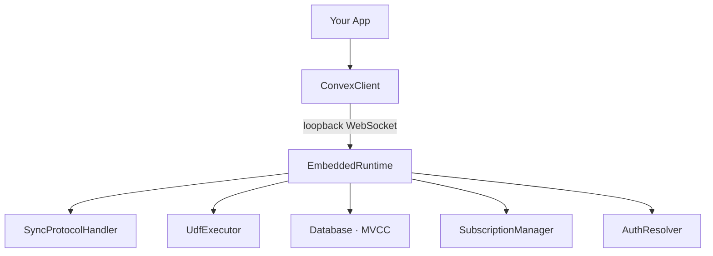
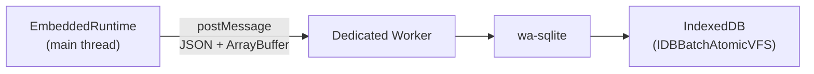
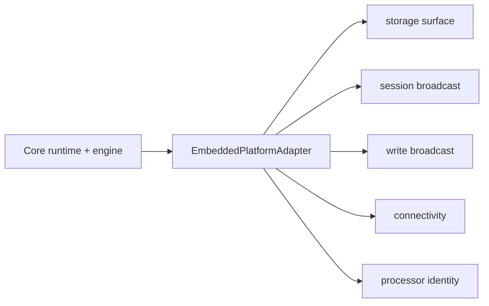
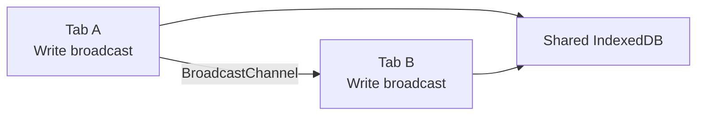
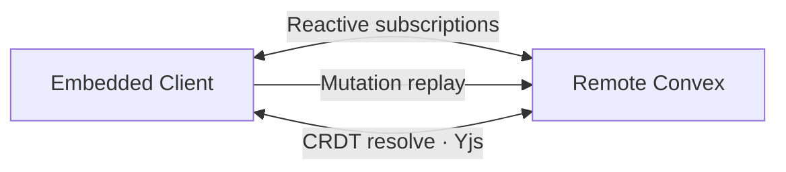

<svelte:head>

  <title>Architecture - convex-embedded</title>
</svelte:head>

# Architecture

`convex-embedded` is composed of several cooperating layers: a main-thread
runtime, a loopback transport, a persistence worker, platform fanout adapters,
and an optional remote sync engine. This page explains how they connect.

## Main-Thread Runtime

The `EmbeddedRuntime` runs on the **main thread**. This is deliberate: Convex
function modules in the lazy ESM registry contain non-cloneable `Function` and
`Proxy` values that cannot cross a worker boundary.

The runtime creates a loopback WebSocket transport that `ConvexClient` connects
to. From the SDK's perspective, it is talking to a real Convex deployment over
WebSocket. In reality, messages are routed to the `SyncProtocolHandler` in the
same thread via an in-memory message queue.

The loopback transport mirrors the Convex wire shape closely enough that the SDK
still sees a normal client connection.

## wa-sqlite in a Dedicated Worker

Persistence is handled by wa-sqlite compiled to WebAssembly, running in a
**Dedicated Worker**. The worker uses `IDBBatchAtomicVFS` to store SQLite pages
in IndexedDB.

Only plain data crosses the worker boundary:

- **JSON strings** -- serialized documents and metadata.
- **`ArrayBuffer`s** -- binary blobs (e.g., Yjs state vectors).

No functions, proxies, or other non-transferable objects are sent across
`postMessage`. The main-thread `PersistenceAdapter` proxy translates each
database operation (hydrate, commit, clear) into an RPC call to the worker and
awaits the response.

The sqlite worker owns engine initialization and opens the configured OPFS
database when the browser client starts.

## Platform Adapters

The current architecture keeps correctness in shared/core code and pushes
environment-specific behavior behind adapters.

Examples:

- persistence worker setup is browser-specific
- `BroadcastChannel` transport is browser-specific
- processor identity generation is platform-specific
- replay leases, queue state, and resolve ordering are core behavior

## Cross-Tab Sync

When multiple tabs share the same `name` (the IndexedDB database name passed to
`createConvexClient`), they all read and write to the same underlying SQLite
database.

After a mutation commits and the write is persisted to IndexedDB, the write
broadcast broadcasts a message listing the tables that changed. Other tabs
receive this notification and:

1. Re-read the affected tables from IndexedDB into their in-memory database.
2. Re-evaluate all active query subscriptions.
3. Push `Transition` messages through their loopback WebSocket so the
   `ConvexClient` sees updated results instantly.

This gives cross-tab reactivity without a server round-trip.

## Remote Sync (Optional)

When a `remote` option is provided to `createConvexClient`, the engine creates a
second `ConvexClient` pointed at the remote Convex deployment. This enables:

### Reactive Subscriptions

For each embedded synced table, the engine subscribes to a remote query (e.g.,
`api.tasks.list`). When the remote pushes new results, the engine diffs them
against local state and calls `ingestDocuments()` to apply changes within a
transaction.

### Mutation Replay

When `client.mutation(api.tasks.create, args)` is called, the patched mutation:

1. Writes locally first (instant, always succeeds).
2. Pushes the mutation to a durable `PendingQueue` backed by the embedded
   database.
3. When online, the queue drains serially. Each replay entry is claimed with a
   processor-scoped lease before the engine forwards it to the remote
   `ConvexClient`.
4. On success, the engine removes the owned entry. On transient failure, it
   releases the entry back to `pending`. On blocked failure, it clears ownership
   and marks the entry `blocked`.

### Replay Lease Ownership

Replay correctness is now core runtime behavior.

- pending entries carry `owner` and `leaseExpiresAt`
- active replay renews the lease while it works
- `stop()` releases any actively owned entry
- a crashed or abandoned processor can be recovered after lease expiry by a
  different processor

The browser only supplies processor identity. It does not define replay
correctness semantics.

### CRDT Resolve on Reconnect

When the client reconnects after being offline, the resolve engine:

1. Encodes each local document into a Yjs state vector.
2. Calls the server-side `resolve` query with these vectors.
3. The server computes diffs against its full Yjs state (stored by the
   component).
4. The client applies diffs to its local Yjs documents and materializes merged
   values back to plain records.
5. Merged documents are ingested into the embedded database, triggering
   subscription updates.

This CRDT pass runs per-table and reports progress via the `RemoteState`
observable.

## Lifecycle

Call `client.close()` to tear down all resources:

- The loopback WebSocket connections are closed (clearing ping intervals).
- The scheduler is shut down and pending timers are cleared.
- The write/session broadcast transports are closed.
- The wa-sqlite worker is terminated.
- If remote is active, the remote `ConvexClient` is closed and all subscriptions
  are unsubscribed.

In SvelteKit, do this in `onDestroy` and `import.meta.hot?.dispose`. In React,
use a cleanup function in `useEffect`.
