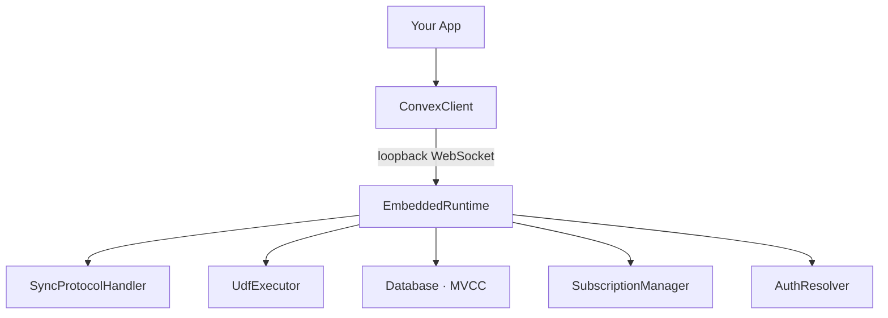
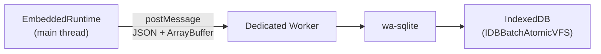
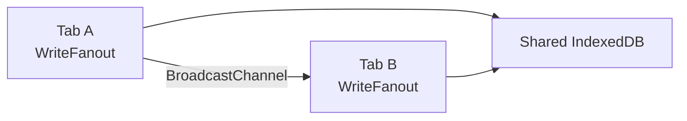
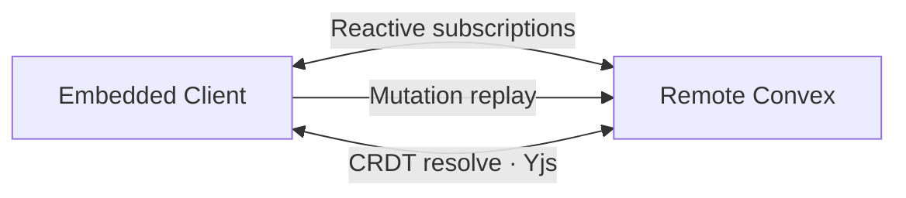

<svelte:head>

  <title>Architecture - convex-embedded</title>
</svelte:head>

# Architecture

`convex-embedded` is composed of several cooperating layers: an in-browser
runtime, a loopback transport, a persistence worker, cross-tab fanout, and an
optional remote engine. This page explains how they connect.

## Main-Thread Runtime

The `EmbeddedRuntime` runs on the **main thread**. This is a deliberate
architectural choice: Convex function modules (loaded via `import.meta.glob`)
contain non-cloneable `Function` and `Proxy` objects that cannot cross a
`postMessage` boundary to a Web Worker.

The runtime creates a loopback WebSocket transport that `ConvexClient` connects
to. From the SDK's perspective, it is talking to a real Convex deployment over
WebSocket. In reality, messages are routed to the `SyncProtocolHandler` in the
same thread via an in-memory message queue.

The loopback transport includes a ping/pong keepalive mechanism matching the
real Convex wire protocol, so the SDK's connection health tracking works
correctly.

## wa-sqlite in a Dedicated Worker

Persistence is handled by wa-sqlite compiled to WebAssembly, running in a
**Dedicated Worker**. The worker uses `IDBBatchAtomicVFS` to store SQLite pages
in IndexedDB.

Only plain data crosses the worker boundary:

- **JSON strings** -- serialized documents and metadata.
- **`ArrayBuffer`s** -- binary blobs (e.g., Yjs state vectors).

No functions, proxies, or other non-transferable objects are sent across
`postMessage`. The main-thread `StorageAdapter` proxy translates each database
operation (hydrate, commit, clear) into an RPC call to the worker and awaits the
response.

The `WebAssembly.Module` is compiled once (via `compileWasmModule()`) and
transferred to the worker at init time, avoiding a second download.

## Cross-Tab Sync

When multiple tabs share the same `name` (the IndexedDB database name passed to
`createConvexClient`), they all read and write to the same underlying SQLite
database.

After a mutation commits and the write is persisted to IndexedDB, the
`WriteFanout` broadcasts a `BroadcastChannel` message listing the tables that
changed. Other tabs receive this notification and:

1. Re-read the affected tables from IndexedDB into their in-memory database.
2. Re-evaluate all active query subscriptions.
3. Push `Transition` messages through their loopback WebSocket so the
   `ConvexClient` sees updated results instantly.

This gives cross-tab reactivity without any server round-trip.

## Remote Sync (Optional)

When a `remote` option is provided to `createConvexClient`, the engine creates a
second `ConvexClient` pointed at the remote Convex deployment. This enables:

### Reactive Subscriptions

For each ready table, the engine subscribes to a remote query (e.g.,
`api.tasks.list`). When the remote pushes new results, the engine diffs them
against local state and calls `ingestDocuments()` to apply changes within a
transaction.

### Mutation Replay

When `client.mutation(api.tasks.create, args)` is called, the patched mutation:

1. Writes locally first (instant, always succeeds).
2. Pushes the mutation to a durable `PendingQueue` backed by the embedded
   database.
3. When online, the queue drains serially: each mutation is forwarded to the
   remote `ConvexClient` with ID translation (local IDs mapped to remote IDs via
   the `IdMap`).

### CRDT Resolve on Reconnect

When the client reconnects after being offline, the resolve engine:

1. Encodes each local document into a Yjs state vector.
2. Calls the server-side `resolve` query with these vectors.
3. The server computes diffs against its full Yjs state (stored by the
   component).
4. The client applies diffs to its local Yjs documents and materializes merged
   values back to plain records.
5. Merged documents are ingested into the embedded database, triggering
   subscription updates.

This CRDT pass runs per-table and reports progress via the `RemoteState`
observable.

## Lifecycle

Call `client.close()` to tear down all resources:

- The loopback WebSocket connections are closed (clearing ping intervals).
- The scheduler is shut down and pending timers are cleared.
- The `WriteFanout` BroadcastChannel is closed.
- The wa-sqlite worker is terminated.
- If remote is active, the remote `ConvexClient` is closed and all subscriptions
  are unsubscribed.

In SvelteKit, do this in `onDestroy` and `import.meta.hot?.dispose`. In React,
use a cleanup function in `useEffect`.
