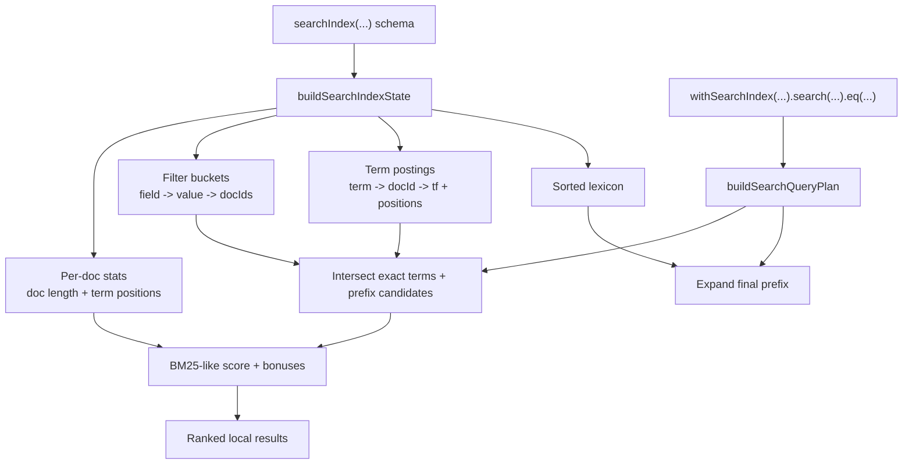

<svelte:head>

  <title>Local Search - convex-embedded</title>
</svelte:head>

<script>
  import Math from "$lib/components/docs/Math.svelte";

  const scoreExpr = String.raw`score = \sum_{g \in groups} BM25(g) + exactMatchBonus + proximityBonus`;
  const bm25Expr = String.raw`BM25(t, d) = \frac{\mathrm{idf}(t) \cdot tf(t, d) \cdot (k_1 + 1)}{tf(t, d) + k_1 \cdot \left(1 - b + b \cdot \frac{|d|}{avgDocLen}\right)}`;
  const idfExpr = String.raw`\mathrm{idf}(t) = \ln\left(1 + \frac{N - df(t) + 0.5}{df(t) + 0.5}\right)`;
</script>

# Local Search

`convex-embedded` now ships a parity-preserving local text search engine for
declared Convex `searchIndex(...)` schemas. The goal is **not** to invent a new
search product. The goal is to behave like Convex text search locally while
using local-first data structures that are fast enough for embedded use.

## DX

The user-facing API is the same shape as normal Convex search:

```ts
export default defineSchema({
  messages: defineTable({
    body: v.string(),
    author: v.string(),
  }).searchIndex("search_body", {
    searchField: "body",
    filterFields: ["author"],
  }),
});
```

```ts
export const search = query({
  args: { q: v.string(), author: v.optional(v.string()) },
  handler: async (ctx, args) => {
    let q = ctx.db
      .query("messages")
      .withSearchIndex("search_body", (q) => q.search("body", args.q));

    if (args.author) {
      q = ctx.db
        .query("messages")
        .withSearchIndex("search_body", (q) =>
          q.search("body", args.q).eq("author", args.author),
        );
    }

    return await q.take(20);
  },
});
```

No separate "local search API" is required. If the table is mirrored locally,
search runs locally.

## Semantics We Preserve

- Query terms are normalized case-insensitively.
- Punctuation is ignored during tokenization.
- Only the **final** query term gets prefix matching.
- Earlier query terms must match exact normalized tokens.
- Equality filters are only allowed on declared `filterFields`.
- Results are ranked by relevance, then by newer `_creationTime` first.

This means a query like `"quick fo"` does **not** mean both words are fuzzy
prefixes. It means:

- `quick` must match as a normalized term
- `fo` is treated as the final prefix term

## Architecture



## Algorithms

At commit time, the embedded database builds a search index per declared search
index:

- `postings`: `term -> docId -> { termFrequency, positions[] }`
- `lexicon`: sorted unique term list used for final-term prefix expansion
- `filterBuckets`: `field -> value -> docIds`
- `docStats`: document length, token positions, and filter values

At query time:

1. Normalize the search string.
2. Split it into exact terms and the final prefix term.
3. Intersect candidate docs from exact terms.
4. Expand the final prefix against the sorted lexicon.
5. Apply `Eq` filter buckets.
6. Score surviving docs.
7. Break ties by newer `_creationTime`.

## Ranking Math

The local engine currently uses a BM25-style score plus small bonuses for exact
matches and tighter proximity spans.

<blockquote>
  <p><Math expr={scoreExpr} /></p>
  <p><Math expr={bm25Expr} /></p>
  <p><Math expr={idfExpr} /></p>
  <p>
    The local engine adds small bonuses for exact term matches and tighter token
    proximity spans, then breaks ties by newer <code>_creationTime</code>.
  </p>
</blockquote>

This is intentionally described as **BM25-style** rather than a promise of
bit-for-bit server parity. Convex search relevance is documented as subject to
change, so the local engine aims for the same behavior model and tie-breaks, not
a frozen implementation clone.

## Performance Notes

The optimized local path only runs on committed state. When there are pending
writes in the in-memory transaction stack, the engine falls back to the
scan-based path so read-your-own-writes semantics stay correct.

That tradeoff keeps behavior correct in transactions while making steady-state
search fast.

## Current Benchmarks

The current benchmark dataset uses `10,000` task docs. Numbers below are from
the optimized branch after the parity-preserving local search redesign.

| Benchmark                         | Hz        | Mean     | Notes                               |
| --------------------------------- | --------- | -------- | ----------------------------------- |
| `full table scan + filter`        | `123.36`  | `8.11ms` | Baseline non-search scan path       |
| `index range Eq(active)`          | `688.05`  | `1.45ms` | Normal secondary index range query  |
| `index range Gt(queued)`          | `1076.09` | `0.93ms` | Binary-search bounded range query   |
| `text search quick prefix`        | `272.21`  | `3.67ms` | Local text search with ranking      |
| `text search quick prefix+filter` | `562.73`  | `1.78ms` | Search plus declared `filterFields` |

Interpretation:

- text search is slower than simple index range lookups, which is expected
- filter buckets materially reduce search work
- local search is still much cheaper than re-querying a remote service for each
  keystroke in a local-first app

## Guardrails

- Search indexes must be declared in schema.
- `searchField` must match the declared field.
- `Eq` filters must be declared in `filterFields`.
- Fuzzy search is intentionally **not** enabled by default.

That keeps local semantics aligned with Convex rather than introducing a second,
more magical local search dialect.
