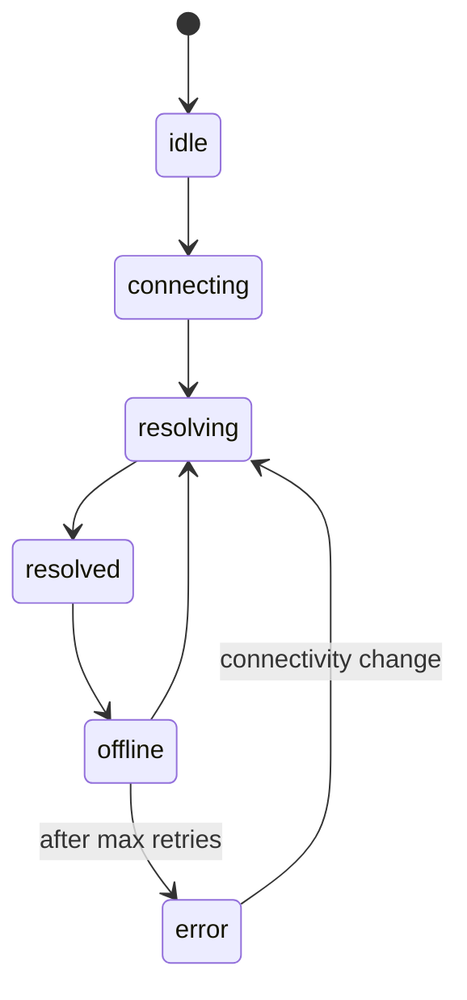

<svelte:head>

  <title>Offline Remote - convex-embedded</title>
</svelte:head>

# Offline Remote

When you pass a `remote` option to `createConvexClient()`, the embedded runtime
becomes a local-first engine. Reads stay local. Writes commit locally first,
then replay to the remote Convex deployment. On reconnect, resolve catches up
any diverged state.

Start with the behavior you can rely on:

- local writes always happen first
- replay uses a durable pending queue
- replay ownership is protected by processor-scoped leases
- reconnect runs resolve before steady-state remote subscriptions resume

## State Machine

The remote engine exposes its current status as a `RemoteState` discriminated
union. The state transitions follow this pattern:



### State Variants

| Status       | Description                                                                                                                             |
| ------------ | --------------------------------------------------------------------------------------------------------------------------------------- |
| `idle`       | Sync was not configured (no `remote` option), or the engine has not started yet.                                                        |
| `connecting` | The remote `ConvexClient` is establishing its WebSocket connection.                                                                     |
| `resolving`  | The CRDT resolve pass is in progress. May include `progress: { completed, total }`.                                                     |
| `resolved`   | All tables are resolved and reactive subscriptions are active. Normal steady state.                                                     |
| `offline`    | Network is unavailable. Mutations still work locally and queue for later replay.                                                        |
| `error`      | The resolve pass failed after exhausting retries. Contains the `error` property. Recovery is attempted on the next connectivity change. |

### Observing State

Use `getRemoteState()` for a one-time read, or `subscribeRemoteState()` to react
to every transition:

```ts
import {
  getRemoteState,
  subscribeRemoteState,
} from "@robelest/convex-embedded/browser";
import type { RemoteState } from "@robelest/convex-embedded/browser";

// One-time read
const state: RemoteState = getRemoteState(client);

// Reactive subscription
const unsub = subscribeRemoteState(client, (state) => {
  switch (state.status) {
    case "resolved":
      badge.textContent = "Online";
      break;
    case "offline":
      badge.textContent = "Offline";
      break;
    case "resolving":
      const p = state.progress;
      badge.textContent = `Syncing ${p?.completed ?? 0}/${p?.total ?? "?"}...`;
      break;
    case "error":
      badge.textContent = `Error: ${state.error?.message}`;
      break;
  }
});

// Clean up when done
unsub();
```

The callback fires synchronously on each state transition. If your callback
performs expensive work (DOM updates, network calls), consider debouncing inside
the callback.

## Local-First Mutations

When you call `client.mutation(api.tasks.create, { title: "Hello" })`, the
patched mutation follows this flow:

1. **Local write** -- the mutation runs against the embedded database. This
   always succeeds, even offline. The `ConvexClient` sees the result instantly.
2. **Queue** -- the mutation is persisted to a `PendingQueue` backed by the
   embedded database. This makes the queue durable across page refreshes.
3. **Replay claim** (when online) -- the queue drains serially. Each entry is
   claimed by a processor with a lease.
4. **Replay** -- the claimed mutation is forwarded to the remote `ConvexClient`
   with ID translation via the `IdMap`.
5. **Confirmation** -- once the remote mutation succeeds, the owned pending
   entry is removed and the ID mapping is stored.

If the remote mutation fails due to an auth error, the engine classifies the
error and may transition to a re-auth state rather than retrying blindly.

## ID Translation

The embedded runtime generates its own document IDs when you call
`ctx.db.insert()`. These local IDs are not valid on the remote Convex backend,
which generates its own IDs.

The `IdMap` maintains a bidirectional mapping between local and remote IDs. When
replaying a mutation:

- If the mutation creates a document, the local ID in the result is mapped to
  the remote ID returned by the remote mutation.
- If the mutation references an existing document by ID (e.g.,
  `ctx.db.patch(id, ...)`), the ID is translated from local to remote before the
  mutation is forwarded.

The IdMap is persisted via the embedded database so it survives page refreshes.

## CRDT Resolve on Reconnect

When the client comes back online after being offline, the resolve engine runs a
per-table CRDT catch-up:

### 1. Encode Local State

For each document in the embedded database, the engine creates a Yjs document
from the field values (using the schema's CRDT field definitions) and encodes
its state vector:

```
local document --> initYjsDoc(schema, doc) --> Y.encodeStateVector(yjsDoc)
```

### 2. Call Server Resolve Query

The encoded state vectors are sent to the server-side `resolve` query
(auto-generated by `embeddedTable()`). The server:

- Reads the latest stored delta for each document from the embedded component.
- Applies the delta to a fresh Yjs document.
- Computes a diff between the server's full Yjs state and the client's state
  vector using `Y.encodeStateAsUpdateV2(serverDoc, clientVector)`.
- Returns only the diff (or nothing, if the client is already up to date).

### 3. Apply Diffs Locally

For each document that has a non-empty diff:

- The client applies the diff to its local Yjs document using
  `Y.applyUpdateV2()`.
- The merged Yjs document is materialized back to a plain record (resolving
  register conflicts, summing counter deltas, etc.).
- The merged record is ingested into the embedded database.

### 4. Resume Reactive Subscriptions

After the resolve pass completes, the engine subscribes to remote queries for
each embedded synced table. These reactive subscriptions keep local state fresh
with changes from other clients in real time. When new results arrive, they are
diffed against local state and ingested.

## Retry Policy

The resolve pass has configurable retry behavior:

```ts
const client = createConvexClient({
  modules,
  remote: {
    url: import.meta.env.CONVEX_URL,
    maxRetries: 5, // default: 3
    retryDelayMs: 2000, // default: 1000
  },
});
```

Retries use exponential backoff with jitter starting from `retryDelayMs`. After
exhausting all retries, the state transitions to `error`. The engine will
attempt recovery on the next connectivity change (e.g., the browser fires an
`online` event).

## Pending Queue Durability

The pending mutation queue is stored in the embedded database. This means:

- Mutations queued while offline survive page refreshes and browser restarts.
- When the user returns to the app and connectivity is available, the queue
  drains automatically.
- The queue processes entries serially to maintain causal ordering.

### Replay lease behavior

Replay ownership is core behavior:

- `claimNext` claims a pending entry with `owner` and `leaseExpiresAt`
- active replay renews its lease
- successful replay removes the owned entry
- unknown failures release the entry back to pending
- blocked failures clear ownership and keep the entry blocked
- expired leases can be reclaimed by another processor after a crash or
  abandoned tab

## Stripping Omitted Fields

When remote documents are received (either via reactive subscriptions or the
resolve pass), any fields marked with `schema.omit()` are stripped before
ingestion into the embedded database. This prevents large or sensitive
server-only data from being stored locally.
