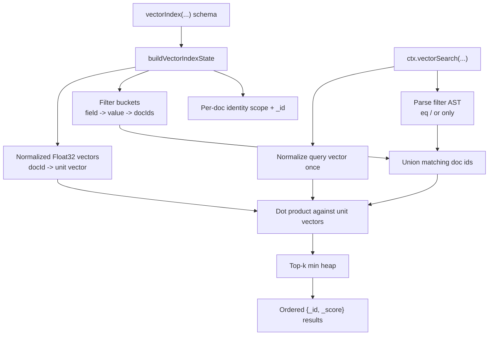

<svelte:head>

  <title>Vector Search - convex-embedded</title>
</svelte:head>

# Vector Search

`convex-embedded` supports local vector search for declared Convex
`.vectorIndex(...)` schemas. The goal is the same as local text search: keep the
DX and result semantics as close to Convex as possible while making the local
path fast enough to use interactively.

## DX

The schema and action API stay the same:

```ts
export default defineSchema({
  documents: defineTable({
    title: v.string(),
    category: v.string(),
    status: v.string(),
    embedding: v.array(v.float64()),
  }).vectorIndex("by_embedding", {
    vectorField: "embedding",
    dimensions: 768,
    filterFields: ["category", "status"],
  }),
});
```

```ts
export const similarDocuments = action({
  args: { embedding: v.array(v.number()) },
  handler: async (ctx, args) => {
    return await ctx.vectorSearch("documents", "by_embedding", {
      vector: args.embedding,
      limit: 16,
      filter: (q) =>
        q.or(q.eq("category", "guide"), q.eq("status", "published")),
    });
  },
});
```

If the mirrored table is available locally, the search runs locally and returns
the usual Convex result shape:

```ts
Array<{ _id: Id<"documents">; _score: number }>;
```

## Semantics We Preserve

- `vectorIndex(...)` definitions come from schema, not ad hoc local config.
- Query vectors must match the declared `dimensions`.
- Results are ordered by `_score` descending, then `_id` ascending.
- Filters only support Convex-style `q.eq(...)` and `q.or(...)`.
- Filters only work on declared `filterFields`.
- The local path is exact cosine similarity, not ANN or fuzzy matching.

This means the local engine is intentionally conservative. It does not invent a
second vector-search dialect.

## Architecture



## Algorithms

At commit time, the embedded database builds a vector index per declared vector
index:

- stored vectors are validated against `dimensions`
- valid vectors are converted to `Float32Array`
- stored vectors are normalized once to unit length
- declared `filterFields` are bucketed for fast candidate preselection

At query time:

1. Validate and normalize the query vector once.
2. Parse the serialized Convex filter expression.
3. Preselect candidate doc ids from filter buckets.
4. Score each surviving candidate with a dot product.
5. Keep only the best `k` results with a min heap.
6. Return results ordered by `_score`, then `_id`.

Because both query and stored vectors are normalized up front, cosine similarity
reduces to a dot product:

```ts
score = dot(queryUnitVector, docUnitVector);
```

## Transaction Semantics

The optimized local path runs on committed index state.

When there are pending writes in the current in-memory transaction stack,
`convex-embedded` falls back to the scan path so read-your-own-writes semantics
stay correct. That keeps behavior safe in transactions while still making the
steady-state local path fast.

## Guardrails

- Vector indexes must be declared in schema.
- `vectorField` and `filterFields` must match the declared index.
- Only `eq(...)` and `or(...)` filters are supported locally, matching Convex.
- Invalid stored vectors are skipped rather than poisoning the whole index.
- Requested `limit` must stay within Convex's bounds.

## Benchmarks

The query-engine benchmark suite now includes vector search cases alongside full
table scan, index range, and text search.

Run the benchmark directly with:

```bash
vp test bench tests/benchmarks/query-engine.bench.ts
```

Or use the root shortcut:

```bash
vp run bench:query-engine
```

The current suite includes:

- `vector search top-10`
- `vector search filtered top-10`
- `vector search filtered top-50`

These are intended to catch regressions as the local query engine evolves.
