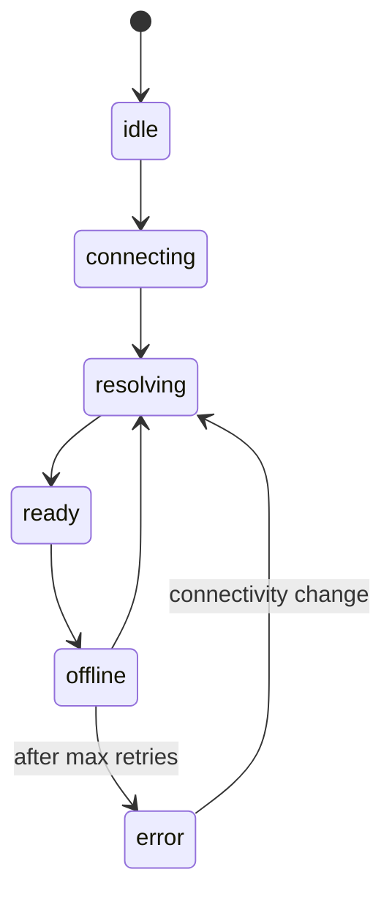

<svelte:head>

  <title>Remote Configuration - convex-embedded</title>
</svelte:head>

# Remote Configuration

convex-embedded supports two modes of operation:

- **Local-only** -- no `remote` option. Data lives entirely in the browser's
  IndexedDB. No network traffic.
- **Local-first** -- with `remote` option. Mutations write locally first
  (instant), then replay to the remote Convex deployment. Reactive subscriptions
  keep local state fresh with changes from other clients. On reconnect after
  being offline, a Yjs CRDT resolve pass merges any diverged state.

## RemoteOptions

Pass a `remote` object to `createConvexClient` to enable remote connection:

```ts
import { createConvexClient } from "@robelest/convex-embedded/browser";

const client = createConvexClient({
  modules: import.meta.glob("./convex/*.ts"),
  remote: {
    url: "https://happy-otter-123.convex.cloud",
    maxRetries: 3,
    retryDelayMs: 1000,
  },
});
```

| Option         | Type     | Default    | Description                                 |
| -------------- | -------- | ---------- | ------------------------------------------- |
| `url`          | `string` | _required_ | Remote Convex deployment URL.               |
| `maxRetries`   | `number` | `3`        | Max retries for CRDT resolve on reconnect.  |
| `retryDelayMs` | `number` | `1000`     | Base retry delay (ms). Exponential backoff. |

### Custom retry policy

For unreliable networks, increase the retry budget:

```ts
const client = createConvexClient({
  modules: import.meta.glob("./convex/*.ts"),
  remote: {
    url: import.meta.env.CONVEX_URL,
    maxRetries: 5,
    retryDelayMs: 2000,
  },
});
```

With `retryDelayMs: 2000` and exponential back-off, retries will be
approximately at 2s, 4s, 8s, 16s, and 32s (plus random jitter).

## Local-only mode

Omit `remote` entirely for a purely local database. No network requests are
made:

```ts
const client = createConvexClient({
  modules: import.meta.glob("./convex/*.ts"),
});
```

You can switch from local-only to local-first later by adding the `remote`
option. Existing local data will be ready on the next resolve pass.

## Sync state machine

The resolve engine transitions through these states:



| State        | Meaning                                                                                                                                                        |
| ------------ | -------------------------------------------------------------------------------------------------------------------------------------------------------------- |
| `idle`       | Sync was not configured, or the engine has not started yet (module discovery in progress).                                                                     |
| `connecting` | The remote `ConvexClient` is establishing its WebSocket connection.                                                                                            |
| `resolving`  | The CRDT resolve pass is in progress. The `progress` field reports completed/total tables.                                                                     |
| `ready`      | All tables are resolved and reactive subscriptions are active. Normal steady state while online.                                                               |
| `offline`    | Network is unavailable. Mutations continue to work locally and are queued for replay. The engine re-resolves automatically when connectivity returns.          |
| `error`      | The resolve pass failed after exhausting retries. The `error` property contains the underlying `Error`. Recovery is attempted on the next connectivity change. |

## Subscribing to remote state

### One-shot read

```ts
import { getRemoteState } from "@robelest/convex-embedded/browser";

const state = getRemoteState(client);
if (state.status === "ready") {
  console.log("All tables are up to date");
}
```

### Reactive subscription

```ts
import { subscribeRemoteState } from "@robelest/convex-embedded/browser";

const unsub = subscribeRemoteState(client, (state) => {
  switch (state.status) {
    case "ready":
      badge.textContent = "Online";
      break;
    case "offline":
      badge.textContent = "Offline";
      break;
    case "resolving":
      badge.textContent = `Syncing ${state.progress?.completed ?? 0}/${state.progress?.total ?? "?"}...`;
      break;
    case "error":
      badge.textContent = `Error: ${state.error?.message}`;
      break;
  }
});

// Call unsub() to stop receiving updates
```

The subscription is safe to call on any `ConvexClient`, including ones not
created by `createConvexClient` -- it returns a no-op unsubscribe in that case.

## Building a remote status indicator

Here is a complete status badge component (Svelte example):

```svelte
<script lang="ts">
  import { getContext } from "svelte";
  import type { RemoteState } from "@robelest/convex-embedded/browser";

  const getSyncStatus = getContext<() => RemoteState>("remoteStatus");

  const statusLabel = $derived.by(() => {
    const s = getSyncStatus();
    switch (s.status) {
      case "idle":       return { text: "Local only",    color: "#9ca3af", bg: "#f3f4f6" };
      case "offline":    return { text: "Offline",       color: "#f59e0b", bg: "#fffbeb" };
      case "connecting": return { text: "Connecting...", color: "#3b82f6", bg: "#eff6ff" };
      case "resolving":    return { text: "Resolving...",    color: "#3b82f6", bg: "#eff6ff" };
      case "ready":     return { text: "Ready",        color: "#10b981", bg: "#ecfdf5" };
      case "error":      return { text: "Sync error",    color: "#ef4444", bg: "#fef2f2" };
    }
  });
</script>

<div
  style="display: flex; align-items: center; gap: 0.5rem; padding: 0.375rem 0.75rem;
         border-radius: 9999px; width: fit-content; font-size: 0.75rem; font-weight: 500;
         background: {statusLabel.bg}; color: {statusLabel.color};"
>
  <span
    style="width: 0.5rem; height: 0.5rem; border-radius: 9999px;
           background: {statusLabel.color};"
  ></span>
  {statusLabel.text}
</div>
```

And the React equivalent:

```tsx
import { useEffect, useState } from "react";
import {
  subscribeRemoteState,
  type RemoteState,
} from "@robelest/convex-embedded/browser";
import type { ConvexClient } from "convex/browser";

function SyncBadge({ client }: { client: ConvexClient }) {
  const [state, setState] = useState<RemoteState>({ status: "idle" });

  useEffect(() => {
    return subscribeRemoteState(client, setState);
  }, [client]);

  const labels: Record<string, { text: string; color: string }> = {
    idle: { text: "Local only", color: "#9ca3af" },
    connecting: { text: "Connecting...", color: "#3b82f6" },
    resolving: { text: "Resolving...", color: "#3b82f6" },
    ready: { text: "Ready", color: "#10b981" },
    offline: { text: "Offline", color: "#f59e0b" },
    error: { text: "Sync error", color: "#ef4444" },
  };

  const label = labels[state.status] ?? {
    text: state.status,
    color: "#9ca3af",
  };

  return (
    <span style={{ color: label.color, fontWeight: 500 }}>{label.text}</span>
  );
}
```

## Module auto-discovery

When remote is enabled, the embedded runtime automatically scans your Convex
modules for `remote metadata` exports (produced by `register()`). Tables with
remote metadata are enrolled for remote. Tables without it remain local-only. No
manual table configuration is needed.
